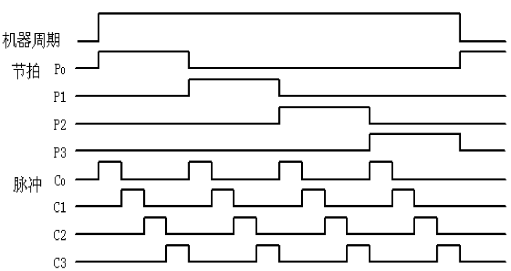

# 第一章 计算机系统概述 #
## 什么是计算机系统，说明计算机系统的体系结构 ##

计算机系统是由硬件和软件两部分组成。
* 硬件
    1. 运算器
    2. 存储器
    3. 控制器
    4. 输入设备
    5. 输出设备
* 软件
    1. 系统程序(用来简化程序设计)
        * 各种服务性程序
        * 语言程序
        * 操作系统
        * 数据库管理系统
    2. 应用程序(解决某些问题而设计的)


### 计算机系统的层次结构 ###
* 高级语言级
* 汇编语言级
* 操作系统级
* 一般机器级
* 微程序设计级

## 冯诺依曼结构计算机的特点是什么，他又那些局限性 ##
### 特点 ###
1. 由五大部件组成：运算器，存储器，控制器，输入设备，输出设备
2. 指令和数据以同等的地位存放在存储器内，可按地址访存
3. 指令和数据均用二进制时表示
4. 指令由操作码和地址码组成
5. 指令在存储器中按顺序存放
6. 机器以运算器为中心，数据传送通过运算器完成

### 局限性 ###
1. 软硬件之间完全分离，只适用数值计算，与高级语言的语义上存在隔阂
2. 存储器是一维线性排列，按顺序排列的地址访问，和高级语言按名字调用由区别
3. 数据本身没有属性标识，对于不同类型的同种操作需要用不同的操作码对数据进行区分

## 计算机内部有哪两种信息流，他们之间有什么关系 ##
* 指令流 
* 数据流

<div id="InfoStream"></div>

**关系:** 指令和数据都放在内存中，他们都是二进制数码。
* 在取指周期中从内存里读出的是指令流，流向控制器;
* 执行周期中从内存中读出的是数据流，流向运算器;

## 计算机采用什么计数制，为什么 ##
采用 *二进制* 计数制;
* 容易表示
* 容易存储
* 计算简单
* 节省设备
* 便于逻辑判断
* 抗干扰逻辑强，可靠性高

## 简述运算器和控制器的主要功能 ##
### 运算器 ###
1. 算数运算
2. 逻辑运算
### 控制器 ###
1. 控制计算机各个部件有序的工作，决定程序的执行顺序

## 简述输入设备和输出设备的基本功能 ##
### 输入设备 ###
```txt
将某种信息形式变化成机器内部所能接受和识别的二进制信息形式
```
### 输出设备 ###
```txt
把计算机处理的结果变换微人或其他机器设备所能接受和识别的信息形式
```
## 算数运算和逻辑运算各包括那些运算操作 ##
### 算数运算 ###
```txt
加，减，乘，除
```
### 逻辑运算 ###
```txt
逻辑与，逻辑或，逻辑非，逻辑异或
```
## 机器语言，汇编语言，高级语言 有何区别 ##
### 机器语言 ###
```txt
计算机能够直接运行的语言，二进制语言，低级语言
```
### 汇编语言 ###
```txt
面向机器的低级语言，不能被机器直接识别，需要编译
```
### 高级语言 ###
```txt
从人类的逻辑思维角度出发的计算机语言，不能被机器直接识别，需要编译
```

## 什么是指令，什么是程序 ##
* **指令:** 指挥机器工作的指示和命令
* **程序:** 指令之间的有序结合

## 存储器中存储的数据和指令是怎么区分的 ##
1. 在取指周期中取出的是指令，在执行周期中取出的是数据
2. 由pc提供存储单元取出的是指令，由指令地址码部分提供的存储单元取出的是数据

## 寄存器的功能是什么 ##
* **指令寄存器(IR):** 最近取出的指令
* **程序计数器(PC):** 将要取出的指令的地址
* **程序状态字(PSW):** 记录程序的运行模式
* **数据寄存器(DR):** 存放数据，用于计算
* **地址寄存器(AR):** 存放地址，用于某种方式的寻址
* **通用寄存器($R_i$):** 保存数据

## 编译程序和解释程序的区别是什么 ##
* **编译程序:** 将源程序翻译成等价的目标程序，然后执行。一次编译，永久运行。
* **解释程序:** 按照源程序中语句的顺序，边解释，边执行。运行一次，编译一次。

## 什么是存储单元，单元地址，存储体，存储容量 ##
* **存储单元:** 多个二进制位组成一个单元，cpu访问存储器的基本单元
* **单元地址:** 每个存储单元所对应的编号
* **存储体:** 大量存储单元的集合
* **存储容量:** 存储器中所有存储单元的总数(存储单元8位，存储容量用KB，MB表示)

## 什么是机器字长，指令字长，存储字长 ##
```txt
都是字节的整数倍
```
* **机器字长:** cpu一次能处理的数据的位数，与cpu寄存器有关
* **指令字长:** 计算机指令字的位数
* **存储字长:** 存储器中一个存储单元所能存储的二进制代码的位数

## 计算机的硬件指标有哪些 ##
* **吞吐量**：某一时间能处理的信息量
* **响应时间**：输入有效到系统响应的时间
* **利用率**：时间间隔内系统被使用的时间的占比
* **处理机字长**： cpu一次处理的位数
* **总线宽度**：运算器和存储器连接的总线的位数
* **存储器容量**：存储单元的个数
* **存储器带宽**：单位时间内读出的二进制数信息量
* **主频**：时钟频率(cpu时钟周期的倒数)
* **cpu执行时间**：时钟周期数×时钟周期
* **CPI**：时钟周期数/指令条数
* **MIPS**：每秒执行多少百万条指令
* **FLOPS**：浮点操作次数/执行时间

## 如何看待指令功能越强，计算机性能越高 ##
```txt
数据总线带宽，cpu主频，CPI，MIPS 。。。
```

## 为什么说计算机硬件和软件在逻辑上是等价的 ##
```txt
软件通过编译生成的机器码指挥硬件工作，本质上基础是布尔逻辑，
而处理器设计的基础也是布尔逻辑，只是性能，成本上的差异。
```
# 第二章 运算方法和运算器 #

## 为什么现代计算器都用补码来表示整数 ##
1. 省去了计算机判断加法和减法的麻烦，使用补码统一使用加法运算
2. 保证了编码的连续性和一致性，不会出现原码中 *+0* *-0* 的不一致

## 为什么浮点数的阶码通常采用移码表示 ##
```txt
移码的本质是对当前数的一个偏移，而偏移量是当前二进制位数去掉符号位所能表示的最大数+1,
因此，经过偏移后，最小的一个数经过偏移成了0(无符号位),向后一直增大。
```
* 方便阶码的比较，用于对阶。

## 何为浮点规格化 为什么要进行浮点数的规格化 ##
```txt
为了提高数据的表示精度。当尾数不为0时，将尾数最高位通过左归为1，同时改变阶码
```

## 写出浮点数加减运算的步骤 在浮点加减法尾数求和过程中，尾数的符号出现了01或10时则说明运算结果溢出，这句话对吗？ 为什么？ ##

### 步骤 ###
* 零操作数检查
* 对阶
* 尾数相加减
* 结果的规格化
* 结果的舍入处理
* 结果的溢出判断

### 溢出 ###

```txt
错，当尾数的符号位01或10时，只是代表尾数表示的位数不够了，因此要先右归一位，将位数多出来的那一位放回到位数，然后再将阶码+1,当阶码溢出时，才是真正的溢出，否则就不是溢出
```

## 试论述在浮点加减运算的过程中，为什么首先要对阶？对阶的原则是什么，反过来有何不可，为什么 ##
**为什么:** 对阶是为了让两个尾数能够正确的进行加减运算。
**原则:** 小阶对大阶，小对大只会损失精度，大对小会导致尾数高位移除，误差会更大

## 分别写出浮点数尾数用原码和补码表示正数和负数的规格化形式 ##
### 正数 ###
* 原码：0.1XXXXX...X
* 补码：0.1XXXXX...X
### 负数 ###
* 原码：1.1XXXXX...X
* 补码：1.0XXXXX...X

## 简述浮点运算器如何判断溢出，如何处理 ##
* 对规格化的阶码**大于**所能表示的最大阶码：上溢，停止运算，中断处理
* 对规格化的阶码**小于**所能表示的最小阶码：下溢，零处理
* 对规格化的尾数=0：零处理
* 对规格化的尾数溢出：右归，改阶码，**不算溢出**

## 采用双符号位检测溢出的方法 对比单符号位有那些优点##
### 方法 ###
* 通过异或的方式判断,结果为1时溢出
    * 当符号位为**01**时：上溢
    * 当符号位为**10**时：下溢

### 优点 ###
* 双符号位在计算后,高位表示应得的符号位,低位表示实际的符号位,判断更方便

## 简要叙述三种不同的判断溢出的方法,注明表达式参数的意义 ##
* 单符号位
* 双符号位
* 进位值
    * 当符号位没变化但产生了进位:正溢($1,11+1,11=1,10$ 进位位变化)
    * 当符号位变化但没有产生进位:负溢($0,11+0,11=1,10$ 进位位不变)

## 简述先行进位解决的问题和基本思想 ##
* 各级之间的进位是独立的，减小了进位时延，加大了计算复杂度。
* 将加法器分级，多个加法器在一级，越到后面计算越复杂。


# 第三章 多层次的存储器 #
## 解释术语  存储元，存储单元，单元地址，存储体，存储容量，存储器 ##
**存储元:** 二进制代码位
**存储单元:** 多个二进制位组成一个单元，cpu访问存储器的基本单元
**单元地址:** 每个存储单元所对应的编号
**存储体:** 大量存储单元的集合
**存储容量:** 存储器中所有存储单元的总数(存储单元8位，存储容量用KB，MB表示)
**存储器:** 硬盘

## 什么是 程序访问的局部性 ，存储系统哪一级采用了这个 ##
**程序访问局部性:** 在某一段时间内频繁的访问某一局部的存储器地址空间，而对此范围以外的地址空间则很少访问
* 时间局部性：最近被访问的信息可能还要被访问
* 空间局部性：最近被访问的信息邻近地址的信息也可能被访问

**存储系统:** 
* cache-主存
* 主存-辅存

## 存储系统如何满足计算机系统对存储的高速度，大容量，低成本的要求 ##
* 高速度：通过cache提升访问速度，与cpu运算速度匹配
* 大容量：通过增加外存储器
* 低成本：使用多级存储体系，合理分配容量，降低成本

## 三级存储体系由那些组成？ cache--主存，主存--辅存 相同点和不同点？ ##
**cache--主存--辅存**

**相同点:**
1. 价格依次降低
2. 容量依次增加
3. 访问时间依次增长
4. CPU访问频率依次减小
   
**不同点:**

|功能|cache-主存|主存-辅存|
|:-------|:--------|:-------|
|目的|弥补速度上的不足|弥补容量上的不足|
|存储管理|全部硬件|主要用软件|
|访问速度比值| <10 |>10|
|每一块大小|几十字节|几百几千字节|
|cpu直接访问|是|通过上一级|
|不命中时cpu是否切换|不切换|切换到其他进程|

## 比较RAM 和ROM ##
|功能|RAM|ROM|
|:----|:----|:----|
|名称|随机存取存储器|只读存储器|
|可擦写|是|否|
|断电可保存|否|是|
|成本|高|低|
|稳定|低|高|

## 访问存储器的平均时间与哪些因素有关 ##
* 存储介质的物理性质
* 寻址部件的结构

## 动态存储器为什么需要刷新? 怎样进行刷新 ##

* 因为动态存储器的读操作的破坏性的,读操作完之后电容器上的电荷流失,读出后必须要刷新,未读写的也要定期刷新
* 通过给电容充电刷新

## 什么是存储器的刷新 刷新有哪些典型的方式 都有什么特点 ##

* 读操作了之后对存储器电容的充电

**刷新方式:**
1. **集中式刷新**
 在2ms内集中安排刷新时间(所有都刷新)
2. **分散式刷新**
 每读或写一次就刷新一次(一行)
3. **异步式刷新**
 在2ms内分散的对每一行进行刷新,刷新时间间隔= ${时间} \over {行数}$ 

## 比较DRAM 和 SRAM 的异同

### 异 ###
|比较|SRAM|DRAM|
|:-|:-|:-|
|速度|快|慢|
|占用空间|小|大|
|成本|高|低|
|使用环境|cache|主存|
|集成度|低|高|
|架构|复杂&多晶体管|简单&多电容|
|刷新|不需要|周期刷新|
|功耗|高|低|

### 同 ###
* 存储数据

## 简述主存储器的基本结构?举例说明存储器的工作过程 ##

**结构**
* 存储体
* 地址寄存器
* 地址译码器
* 数据缓冲寄存器
* 读写控制线路

**工作过程**

* 读周期:
    地址线先有效,然后片选信号和使能信号有效,可将数据读出到i/o总线,之后片选和使能恢复.
* 写周期:
    地址线先有效,然后片选信号和写命令信号有效,将i/o总线上的数据写入,之后片选和写命令恢复.

## 简述高速缓存和主存之间的地址映射方式 ##

**直接映射:** 多对一,主存中的一块只能映像到cache中的某一块
**全相联映射:** 多对多,主存中任何一块都可以映射到cache中的任意一块
**组相联映射:** 组和组之间直接映射,组内全相联映射

## 高速缓存的设计应解决什么问题 ##

### 高速缓存和主存之间的性能差 ###

**指令cache和数据cache:** 取指令和存取数据经常冲突,故分成两个独立的cache
**多层次的cache:** 二级缓存在cpu外,连接主存和一级缓存,当作缓冲区
**cache的一致性:** 
    * 写回法:被修改的cache块,只有被替换的时候才写回主存
    * 写直达法:修改cache块的同时,修改主存内容
    * 写一次法:第一次写命中时使用写直达法,再次命中或未命中用写回法

## 高速缓存的替换算法 ##

**先进先出(FIFO):** 最先进入的块最先替换
**最近最少使用(LRU):** 建立LRU目录,记录调用情况,替换最少使用的

## 为什么多体交叉存储器可以提高访问速度 ##
使用顺序模式只能依次访问相邻的存储单元,但是多模块可以同时访问多个相邻的存储单元,流水线方式


# 指令系统 #

## 简述指令字长,存储字长,机器字长 ##

**机器字长:** cpu一次能处理的位数,与寄存器位数有关
**指令字长:** 指令字的长度
**存储字长:** 存储单元的所能存储的字长的位数

## 什么是指令地址,形式地址,有效地址 ##

指令地址:指令所在的地址
形式地址:依据某种方式变换为有效地址
有效地址:实际访存地址

## RISC指令系统具有哪些主要特点 ##
1. 选取适用频率最高的简单指令,指令条数少
2. 指令长度固定,指令格式种类少,寻址方式种类少
3. 只有取数/存数指令访问存储器

## 数据的寻址方式有哪几种 最常用的是那一种 ##
1. **隐含寻址**
2. **立即寻址**
3. **直接寻址**
4. **间接寻址**
5. **寄存器寻址**
6. **寄存器间接寻址**
7. 偏移寻址
    * **相对寻址**
    * **基址寻址**
    * **变址寻址**
8. 段寻址
9. 堆栈寻址

## 比较寄存器寻址和寄存器间接寻址的区别 ##
* 寄存器寻址:寄存器中存放的是数据
* 寄存器间接寻址:寄存器中存放的地址上的数据是一个地址,再继续寻址...

## 在 RR型,RS型,SS型 的指令中,那一类执行时间最长,哪个最短,why?
RR型最短,SS型最长
RR型不需要访问内存,SS型多次访问内存

## 影响指令字长度的因素有哪些 ##
1. 操作码的长度
2. 操作数地址的长度
3. 操作数地址的个数
4. 寻址方式

## 设计指令格式时应考虑哪些因素 ##
1. 指令系统的兼容性
2. 指令的个数
3. 参与操作的数据类型
4. 指令格式
5. 寄存器个数

## 各类寻址方式中,哪类最快,哪类最慢,why? ##
**最快:** 立即寻址,隐含寻址,寄存器寻址
> 不访问内存,地址码就是操作数,不需要访问主存,只需要访问寄存器
> 
**最慢:** 间接寻址 
> 多次访问主存,速度最慢

## 简述相对寻址的特点 ##
* 将pc中的值与指令中的立即数相加,得到有效地址
* 指令中的数值位数决定操作数的寻址范围

## 一个完整的指令系统 ,应当有哪几类指令 ##
1. 数据处理
2. 数据存储
3. 数据传输
4. 程序控制
## 什么是扩展操作码技术 ##
> 通过扩展操作码的位数,实现操作码数量的提高
* 短码不能是长码的前缀(四位的一地址只有15种操作码,全1为二地址码的标识)
* 各指令的操作码不能重复

# 中央处理器 #

## cpu 有哪些功能,有哪些基本组成部分,有哪些主要的寄存器 ##
### 功能 ###
1. 指令控制
2. 操作控制
3. 时间控制
4. 数据加工
### 组成部分 ###
1. 控制器
2. 运算器
3. 片内cache
### 主要寄存器 ###
1. 数据缓冲寄存器(DR)
2. 指令寄存器(IR)
3. 程序计数器(PC)
4. 数据地址计数器(AR)
5. 通用寄存器($R_i$)
6. 程序状态字寄存器(PSWR)

## 控制器由哪些部件构成,有哪些基本功能 ##

### 构成 ###
* 程序控制器(PC)
* 指令寄存器(IR)
* 指令译码器(ID)
* 时序产生器
* 操作控制器(OC)

### 基本功能 ###
> 依次取出指令,完成指令所要求的操作

* 取出指令
  
* 对指令译码,测试
* 有序的发出各种操作命令到相关部件
* 建立数据通路,完成指令规定的操作
* 处理异常情况和特殊请求
* 依次取出新指令

## 与组合逻辑控制器相比,微程序控制器有哪些优点 ##
* 简单
* 便宜
* 灵活
* 可维护

## 机器指令和微指令的关系 ##
一条机器指令由**多条**微指令组成
机器指令由**操作码**和**操作数**组成

## 存储器中有若干个数据类型:指令代码,运算数据,堆栈数据,字符代码,BCD码,计算机是如何区别这些代码的 ##

## 计算机时序控制方式法为哪两大类,比较优缺点 ##
* 同步控制
> 在任何情况下,指令执行所需要的cpu周期数和时钟周期数不变
* 异步控制
> 每条指令执行周期的cpu周期不同,当执行部件发出**应答**后,才撤销控制信号
* 联合控制
> 大部分操作按照同步控制,小部分时间难以控制的操作用异步控制
> cpu**周期**固定,每条指令的cpu**周期数**不固定

## 画出指令周期的流程图,分别说明每个子周期的作用 ##


## 微程序操作的控制思想是什么 ##
> 把操作控制信号编制成微指令,存放在存储器中,运行时取出微指令,从而产生运行所需要的控制信号.用软件的方法设计硬件技术

## 微程序的控制器有什么特点 ##

* **控制存储器(CM):** 存放所有的微程序(ROM)
* **微指令寄存器:** 
    * 微命令寄存器($\mu$IR) : 保存指令的操作控制字段,判别测试字段的信息
    * 微地址寄存器($\mu$AR) : 要访问的下一条微指令的地址 
* **地址转移逻辑:** 
  * 如果不跳转,下一条指令就由微命令寄存器给出.
  * 如果跳转,根据判别测试字段和执行部件的状态条件反馈信息,修改$\mu$AR内容,形成新的下一条微指令地址.
## 微指令编码有哪三种方式,微指令格式有哪几种 ##
### 方式 ###
* 直接表示法

  * 简单直观,控制速度快,输出可以直接用于控制
  * 代码效率低,控制字段长
* 编码表示法

  * 缩短控制字符的长度
  * 需要译码,速度比较慢
  * **需要留出一个空码,以便表示无操作**
* 混合表示法
> 上述两种方法一起使用
### 格式 ###
* 水平型微指令
> 执行时间短,微指令字较长但微程序短,不易掌握,可读性差,效率高,操作能力强(可完成多个操作)

  * 全水平型微指令(不译码法)
  * 字段译码法水平型微指令
  * 直接和译码相混合的水平型指令
* 垂直型微指令
> 执行时间长,微指令字短但微程序长,易掌握,可读性好,效率低,操作能力弱(一般只完成一个操作)
> 结构类似机器指令结构,需要采用微操作编译法产生操作命令

## 简述指令周期,机器周期,时钟周期的概念,之间的关系 ##
* **指令周期:** $取指时间+执行时间$
* **机器周期:** cpu从内存中读取一条指令字所需的最短时间
* **时钟周期:** 时钟T周期,节拍脉冲. 一个时钟周期内cpu只完成一个最基本的动作

**指令周期中包含至少两个机器周期;机器周期中包含多个时钟周期**


## 什么是cpu时序,它是如何产生的,有什么作用 ##

**产生:** 由时序信号产生器产生


**作用:** 
 * OC用时序信号协调,指挥机器工作时序
 * cpu通过脉冲对各种OC进行严格的时序控制
 * cpu通过时序信号周期判断从内存中取出的是数据还是指令

## 指令与数据以什么形式存在计算机中的,根据什么来判断是指令还是数据 ##
* 以二进制的方式存储
* <a href="#InfoStream">通过是取指周期还是执行周期;通过数据的来源</a>

